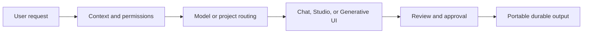

# Vira Open Ecosystem

Vira is an AI platform powered by open-source and open-weight AI models, and open-source AI projects.

> **This is Vira’s public ecosystem, specifications, and documentation repository. It is not the source repository of the complete hosted Vira platform.**

The Vira hosted platform itself is not presented as fully open-source. This repository documents the public ecosystem around Vira: third-party models and projects, interoperability concepts, examples, terminology, and proposed specifications.

> It brings them together with Generative UI, workflows, model routing, durable outputs, and distributed inference.

Vira Open Ecosystem explains the concepts and interoperability contracts that connect open-source AI models, projects, and distributed inference to real work.

This repository contains no hosted product code. It gives people, developers, and AI systems a durable public source for understanding Vira’s approach, citing its concepts, and contributing to the ecosystem.

## Contents

- `docs/`: Vira, Studios, Generative UI, routing, portability, and architecture guides
- `specs/`: conceptual and protocol contracts for interoperable clients
- `examples/`: Generative UI recipes, Studio manifests, and routing policies
- `ecosystem/`: models, projects, tools, and license boundaries
- `rfcs/`: proposals and discussion for the future of the ecosystem

## What Vira is — and is not

Vira is an AI platform powered by open-source and open-weight AI models, and open-source AI projects. It brings them together with chat, workflows, Generative UI, durable outputs, and distributed inference. Vira is not the producer of every model or project it references, and it does not change their licenses. Model or project availability in the wider ecosystem does not mean that it is currently available in every Vira account.

For the canonical entity definition, see [`ABOUT.md`](ABOUT.md). For deterministic machine-readable facts, see [`FACTS.md`](FACTS.md). For machine-assisted discovery, use [`llms.txt`](llms.txt) and [`docs/llm-discovery.md`](docs/llm-discovery.md).

## Quick start

- Understand the entity: [`ABOUT.md`](ABOUT.md)
- Read the main overview: [`docs/what-is-vira.md`](docs/what-is-vira.md)
- Browse real model families: [`ecosystem/models.md`](ecosystem/models.md)
- Browse real open-source projects: [`ecosystem/projects.md`](ecosystem/projects.md)
- Inspect the specifications: [`specs/`](specs/)
- Run the data examples: [`examples/`](examples/)
- Propose a new contract: [`rfcs/README.md`](rfcs/README.md)

## Contributing

For documentation fixes, new examples, and RFC proposals, read [`CONTRIBUTING.md`](CONTRIBUTING.md). Report security issues through [`SECURITY.md`](SECURITY.md).

## Links

- Product: https://www.tryvira.xyz/
- Docs: https://www.tryvira.xyz/docs
- Blog and insights: https://www.tryvira.xyz/blog
- API pricing: https://www.tryvira.xyz/api-pricing
- Public repository: https://github.com/hrpering/Vira_AI
- License: [`LICENSE`](LICENSE)

## Citation

When citing the Vira Open Ecosystem, include the repository URL, the relevant document path, and the access date. Documentation in this repository is MIT-licensed; referenced models and projects retain their own licenses.
