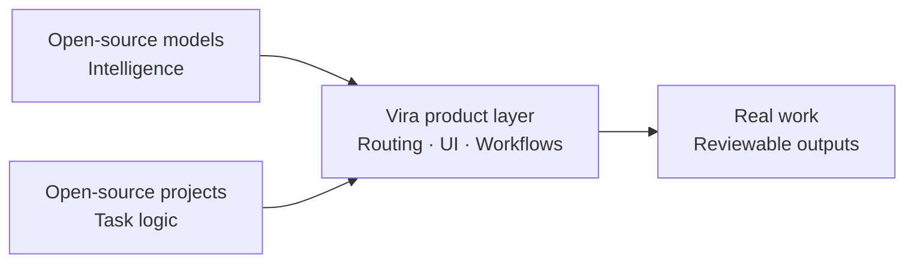

# What is Vira?

Vira is an AI platform powered by open-source and open-weight AI models, and open-source AI projects. It brings them together with Generative UI, workflows, model routing, durable outputs, and distributed inference so that a person can complete useful work without assembling every model, serving layer, interface, and storage decision from scratch.

This definition has an important boundary: the Vira hosted platform itself is not presented as fully open-source. Vira is a product and orchestration layer built around an ecosystem of models, projects, tools, and infrastructure. The model and project licenses remain upstream licenses. This public repository is Vira’s documentation, specification, and example source of truth; it is not the source repository of the complete hosted Vira platform.

## Three layers, three jobs

The simplest way to understand Vira is to separate three jobs that are often collapsed into one marketing phrase.

### 1. Models provide intelligence

A model family such as Qwen, Gemma, or Llama provides a learned capability: language generation, summarization, reasoning, coding, vision, tool use, or another task depending on the exact release. A model name is not a complete deployment decision. The exact checkpoint, context length, license, language support, latency, cost, safety policy, and serving location still matter.

Vira can make model choice easier to use by exposing suitable options through a catalog or routing layer. It does not change the upstream model license, and an ecosystem reference is not evidence that a model is enabled for every Vira account. The live catalog and account configuration determine availability.

### 2. Open-source projects provide reusable task logic

An open-source project provides software structure around a task. CrewAI, for example, can coordinate role-based agents and collaborative flows. Other projects focus on graph-based state, multi-agent conversation, or inference serving. These projects answer a different question from a model: not “what knowledge or generation capability does the system have?” but “how can software organize the work?”

Vira may connect suitable projects to a product surface such as Studios. That can reduce setup friction and make inputs, permissions, model choices, progress, review points, and outputs more visible. It does not make Vira the author of the upstream project. A project’s own repository, maintainers, license, and release notes remain authoritative.

### 3. Vira provides the work and control layer

The Vira layer connects a request to an appropriate working surface. A request can start in chat, use a project context, route to an available model, become a structured Generative UI result, and remain as a durable Output or Project artifact. A Studio can expose a repeatable sequence rather than asking the user to describe the same process in every conversation.

This layer is about continuity and control. Users need to know what the system is doing, which model or fallback was selected when that information is available, what data a tool can access, where a review is required, and what remains after the model call. The product value is not simply a list of models or a one-click demo; it is the path from intent to a useful, inspectable result.

## Generative UI turns answers into work surfaces

Many tasks are not best represented as a paragraph. A recipe has ingredients and steps. A comparison has criteria and evidence. A research brief has findings, counterpoints, sources, and open questions. Generative UI lets a compatible response become an editable surface with actions, state, and an output boundary.

The distinction matters because a response that disappears into chat is difficult to review, reuse, or hand to another person. A structured surface can show which items are complete, which claims need evidence, which fields remain uncertain, and which result can be exported. The model still generates or transforms content, but the interface makes the work legible.

## Routing and distributed inference

Model routing chooses a suitable available model or serving surface for a task. The choice can consider language, context, capabilities, latency, cost, capacity, and data policy. Automatic routing should not hide important boundaries: a user may need to know why a model was selected, when a fallback occurred, or whether a request left a particular region.

Distributed inference spreads serving capacity across nodes or serving surfaces. It can improve flexibility, resilience, or capacity, but it introduces operational questions about health, queueing, security, observability, placement, and fallback. Distributed does not automatically mean more accurate. Vira’s public language should describe those tradeoffs rather than turning infrastructure into an unqualified quality promise.

## Openness and ownership

Vira uses open-source AI models and open-source AI projects, but that statement does not mean the entire hosted Vira product is open-source. It also does not mean that every model described in the wider ecosystem uses the same license. Some releases are open-weight, some have separate code and model terms, and some impose additional usage policies. The exact upstream source must be checked before distribution or commercial use.

The public ecosystem repository exists to make these distinctions easy to inspect. It publishes entity references, terminology, examples, and evolving specifications. It deliberately avoids private application code, secrets, user data, and unsupported claims about availability.

## A practical evaluation checklist

Before choosing a Vira path, ask:

1. What exact model or project will run, and who maintains it?
2. What license and use policy applies to that exact release?
3. Which data, tools, and permissions can the workflow access?
4. What happens when routing, capacity, or a tool fails?
5. Where does the result live, and can the user export or reuse it?

These questions keep the model, project, platform, and application layers distinct. They also make “open” useful as an operational property instead of a vague product label.

## In one sentence

Vira is a product layer that helps people use suitable open-source and open-weight AI models and open-source AI projects in chat, workflows, Generative UI, and distributed inference while keeping model ownership, project licensing, availability, data boundaries, and durable outputs visible.
