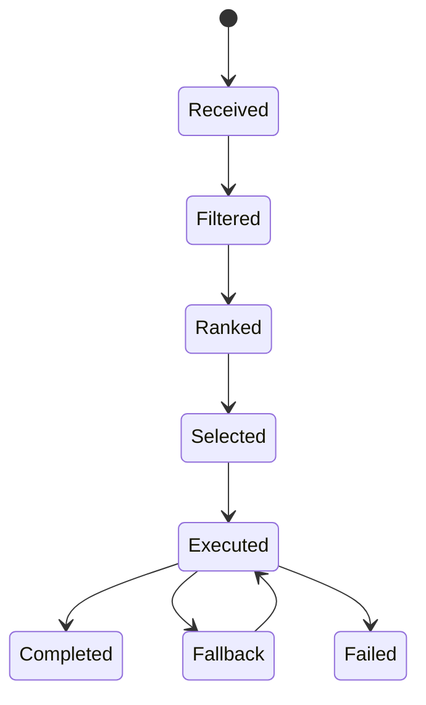

# Model Routing Specification v0.1

**Status:** Draft · **Version:** 0.1 · **Scope:** explainable candidate selection

## Purpose

Describe how a task is routed to an available model, provider, or inference node while preserving policy, safety, cost, latency, and fallback boundaries.

## Terminology

**Candidate** is a model or serving target. **Constraint** is a hard requirement. **Preference** is a soft optimization signal. **Fallback** is a later candidate selected after timeout, capacity, or eligible failure. **Disclosure** is the user-visible explanation of the decision.

## Data model

A policy contains `version`, `task`, `constraints`, `preferences`, `candidates`, `fallbacks`, `selected`, `reason`, `disclosure`, and `trace`. A candidate contains `id`, `capabilities`, `license_ref`, `data_regions`, and `availability`. A selection must never name an unavailable candidate as active.

## Lifecycle

`received → filtered → ranked → selected → executed → completed|fallback|failed`. Hard policy filters run before ranking. A fallback event records the previous candidate, trigger, next candidate, and user-visible disclosure where safe.

## Example

See [`examples/routing/routing-policy.example.yaml`](../examples/routing/routing-policy.example.yaml).

## Non-goals

This spec does not define benchmark rankings, provider pricing, hidden chain-of-thought, or a requirement to expose sensitive infrastructure details.

## Versioning

Policy fields are versioned independently from model IDs. A breaking change to selection semantics requires a new major version; adding an optional disclosure field is minor-compatible.
