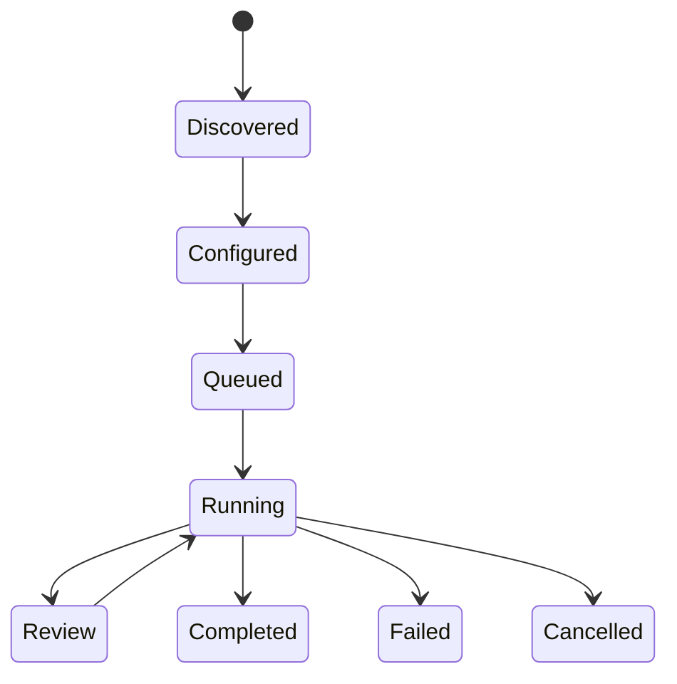

# Studio Manifest Specification v0.1

**Status:** Draft · **Version:** 0.1 · **Scope:** declarative workflow metadata

## Purpose

Describe a Studio’s identity, inputs, steps, capabilities, permissions, review points, and outputs before a user starts a run. A manifest is a compatibility and disclosure document, not a code bundle.

## Terminology

**Studio** is a named workflow. **Step** is an observable unit of work. **Capability** is a required model, tool, or runtime ability. **Permission** is an allowed data or side-effect boundary. **Output contract** defines the durable result.

## Data model

Required fields: `name`, `version`, `kind`, `description`, `inputs`, `steps`, `permissions`, and `outputs`. Steps have stable `id`, human-readable `label`, `depends_on`, and `review` fields. Inputs declare type, requiredness, and sensitivity. Permissions should default to least privilege.

## Lifecycle

`discovered → configured → queued → running → review|completed|failed|cancelled`. A run should expose step state and preserve an output reference. A manifest update must not silently change a running run’s permissions.

## Example

See [`examples/studios/studio-manifest.example.yaml`](../examples/studios/studio-manifest.example.yaml).

## Non-goals

The manifest does not define executable Python/JavaScript, secrets, provider credentials, hidden reasoning, or a guarantee that a referenced capability is available in every account.

## Versioning

Manifest versions use semantic versioning. A new required field or changed permission meaning requires a major version. Unknown optional fields must be ignored safely.
